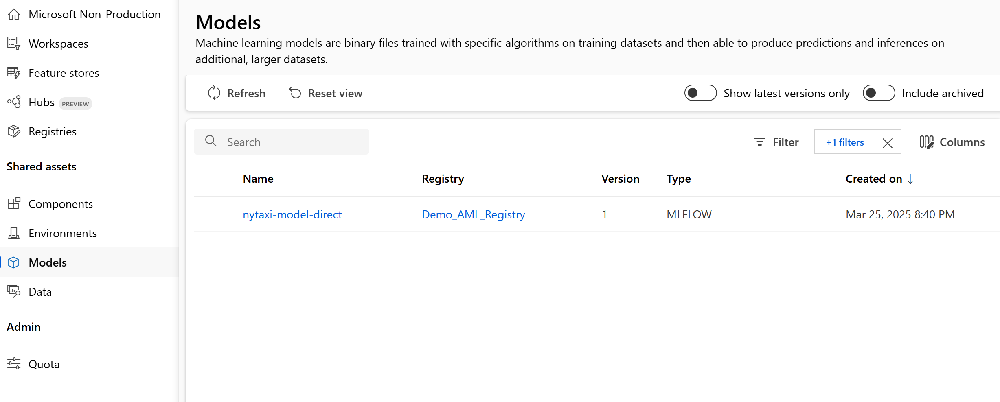

# MLOps with Azure ML Registry: Sharing ML models across Azure ML workspaces

Azure ML registry supports MLOps process in Azure ML environment, providing centralised repository for management and sharing of ML models, components and other artifacts across various workspaces.

This repo provides Jupyter notebook and required MLFlow model components to demo the process of sharing ML models between Staging and Production workspaces.

> [!NOTE]
> MLFlow model used in this demo was borrowed from Microsoft's [Azure Machine Learning examples](https://github.com/Azure/azureml-examples) repo.

## Table of contents:
- [Configuring environment](#configuring-environment)
- [Scenario 1: Direct model registration](#scenario-1-direct-model-registration)
- [Scenario 2: Workspace-to-Registry model sharing](#scenario-2-workspace-to-registry-model-sharing)

## Configuring environment
1. Install Azure ML SDK and Azure Identity Python packages:
``` PowerShell
pip install --upgrade azure-ai-ml azure-identity
```
2. Add required variables to specify Azure subscription, ML workspace and registry details:

| Variable | Description |
| --- | --- |
| ```subscription_id``` | Azure subscription ID |
| ```aml_staging_name``` | AML staging workspace name |
| ```aml_staging_rg``` | AML staging resource group name |
| ```aml_production_name``` | AML production workspace name |
| ```aml_production_rg``` | AML production resource group name |
| ```aml_registry_name``` | AML registry name |
| ```aml_registry_location``` | AML registry location |
| ```model_name``` | model name |
| ```model_path``` | model path |
| ```model_version``` | model version |

3. Authenticate to your Azure resources. *DefaultAzureCredential* should cover most of the authentication scenarios, with fallback option of interactive authentication in a browser through *InteractiveBrowserCredential*:
``` Python
try:
    credential = DefaultAzureCredential()
    credential.get_token("https://management.azure.com/.default")
except Exception as ex:
    credential = InteractiveBrowserCredential()
```
4. Connect to your registry and each Azure ML workspace:
``` Python
ml_client_registry = MLClient(
    credential = credential,
    registry_name = aml_registry_name,
    registry_location = aml_registry_location
)

ml_client_workspace = MLClient(
    credential = credential,
    subscription_id = subscription_id,
    resource_group_name = aml_workspace_rg,
    workspace_name = aml_workspace_name
)
```

## Scenario 1: Direct model registration
This scenario demonstrates how to register an MLFlow model directly into the Azure ML registry from a workspace.
1. Initialise Model class with details of your trained model. This repo uses local version of MLFlow model, while you can adjust the code to refer to ML model trained in Azure ML:
``` Python
mlflow_model = Model(
    path = model_path,
    type = AssetTypes.MLFLOW_MODEL,
    name = model_name,
    version = model_version,
    description = model_description,
)
```
2. Use registry instance to register your model:
``` Python
ml_client_registry.models.create_or_update(mlflow_model)
```
3. If successful, you should find your model in the registry's artifacts list:

> [!NOTE]
> Attempts to re-register model with the same name and version will fail.

## Scenario 2: Workspace-to-Registry model sharing
This scenario showcases the process of sharing an MLFlow model from a Staging workspace to a Production workspace via the Azure ML registry.
